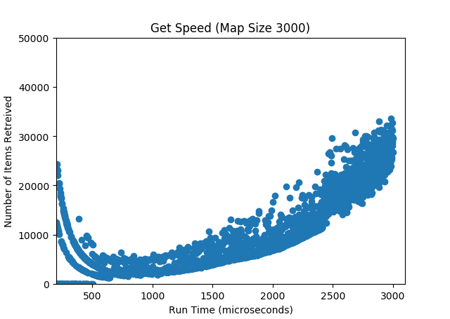
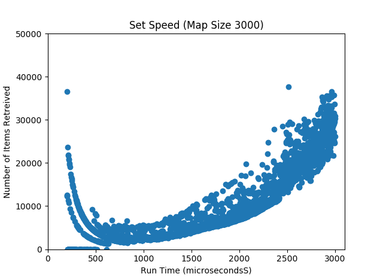
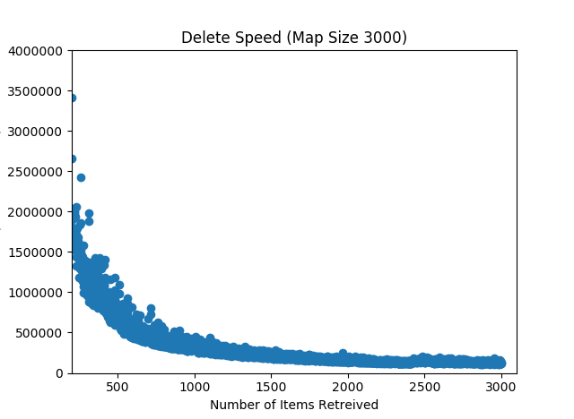

# KPCB HashMap
I created and analysed my own implementation of a hash map using lists, single hashing and closed addresing.  
I used pyplot to visualize the run time of my algorythm for getting, setting, and deleting 3000 key-value pairs
This experiement was carried out for 100 sets of key-value pairs and the results were averaged. 

